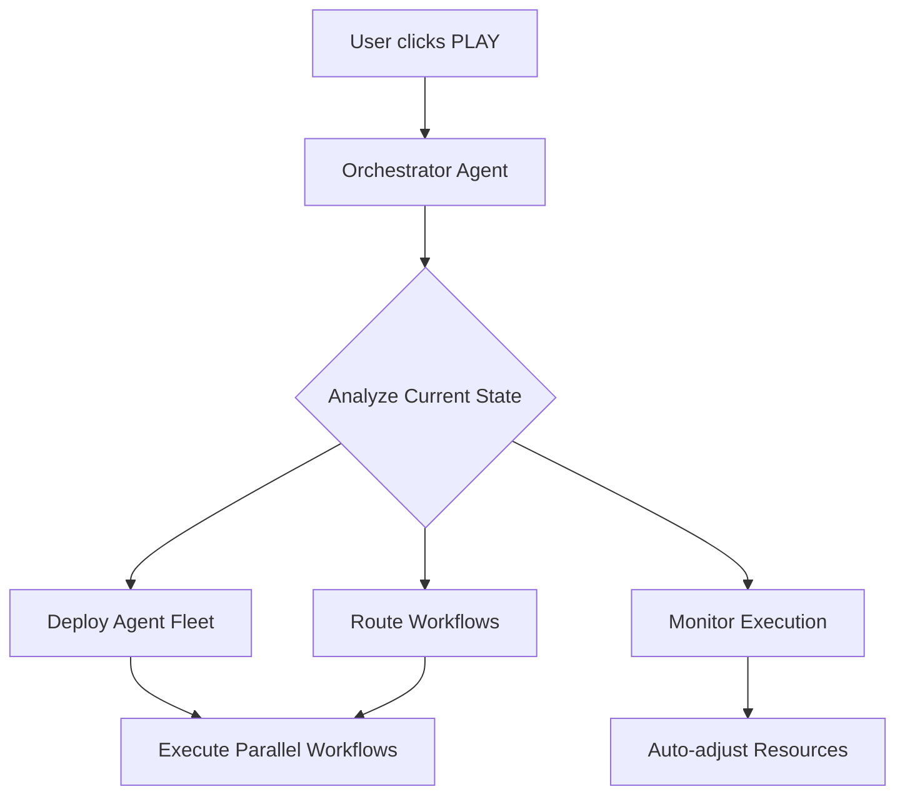

# 🤖 AI AGENT ARCHITECTURE - COMPLETE AUTOMATION SYSTEM

## 🎯 MỤC TIÊU CHÍNH

**"Nhấn Play → Mọi thứ tự động hóa hoàn toàn"**

## 🏗️ KIẾN TRÚC AI AGENT HỆ THỐNG

### 📊 **PHÂN TÍCH NỀN TẢNG HIỆN TẠI**

#### ✅ **Đã có (Foundation solid)**

- **Database Schema**: Hoàn chỉnh với agents, triggers, workflows
- **UI Dashboard**: Category-based agent management
- **Basic Workflows**: Content writer, social media, lead nurture
- **n8n Integration**: MCP protocol + workflow templates
- **Real-time Updates**: Supabase subscriptions

#### ❌ **Thiếu để đạt 100% automation**

- **Orchestration Engine**: Master controller cho multi-agent workflows
- **Smart Triggers**: Event-driven automation cascades
- **Decision Intelligence**: AI-powered workflow routing
- **Auto-scaling**: Dynamic resource allocation
- **Recovery System**: Error handling & auto-retry
- **Performance Optimization**: Intelligent scheduling

---

## 🎭 **AI AGENT TYPES DESIGN**

### 🎬 **1. ORCHESTRATOR AGENT (Master Controller)**

```typescript
type: 'orchestrator'
role: 'Master workflow conductor'
capabilities: [
  'Multi-agent coordination',
  'Workflow dependency management', 
  'Resource allocation',
  'Performance monitoring',
  'Auto-scaling decisions'
]
```

**Workflow Logic:**



### 🧠 **2. INTELLIGENCE AGENT (Decision Maker)**

```typescript
type: 'intelligence' 
role: 'Smart decision routing'
capabilities: [
  'Context analysis',
  'Priority assessment',
  'Resource optimization',
  'Performance prediction',
  'Risk evaluation'
]
```

### 🔄 **3. WORKFLOW AGENTS (Execution Specialists)**

#### **Content Production Pipeline**

```typescript
ContentPipelineAgent: {
  triggers: ['new_contact', 'scheduled_time', 'manual'],
  workflow: [
    'topic_research → content_outline → writing → seo_optimization → publishing'
  ],
  parallel_execution: true,
  auto_scaling: true
}
```

#### **Marketing Automation Pipeline**

```typescript
MarketingPipelineAgent: {
  triggers: ['content_published', 'lead_scored', 'campaign_trigger'],
  workflow: [
    'content_adaptation → multi_platform_posting → email_sequences → engagement_tracking'
  ],
  cross_platform: ['linkedin', 'facebook', 'twitter', 'email'],
  auto_scheduling: true
}
```

#### **Lead Processing Pipeline**

```typescript
LeadPipelineAgent: {
  triggers: ['form_submission', 'email_interaction', 'social_engagement'],
  workflow: [
    'lead_scoring → segmentation → personalization → nurture_sequence → conversion_tracking'
  ],
  smart_routing: true,
  behavioral_triggers: true
}
```

#### **Analytics & Optimization Pipeline**

```typescript
AnalyticsPipelineAgent: {
  triggers: ['hourly', 'performance_threshold', 'anomaly_detected'],
  workflow: [
    'data_collection → pattern_analysis → insight_generation → optimization_recommendations → auto_implementation'
  ],
  real_time_monitoring: true,
  predictive_analytics: true
}
```

---

## ⚙️ **N8N WORKFLOW ARCHITECTURE**

### 🎯 **Master Orchestrator Workflow**

```json
{
  "name": "AI Agent Orchestrator",
  "nodes": [
    {
      "name": "Play Button Trigger",
      "type": "n8n-nodes-base.webhook",
      "webhook_url": "/automation/start"
    },
    {
      "name": "System State Analysis", 
      "type": "n8n-nodes-base.code",
      "code": "analyzeCurrentSystemState()"
    },
    {
      "name": "Agent Fleet Deployment",
      "type": "n8n-nodes-base.split",
      "options": {
        "parallel_execution": true,
        "agents": ["content", "marketing", "lead", "analytics"]
      }
    },
    {
      "name": "Performance Monitor",
      "type": "n8n-nodes-base.cron",
      "expression": "*/5 * * * *"
    },
    {
      "name": "Auto-optimization",
      "type": "n8n-nodes-base.code",
      "code": "optimizeResourceAllocation()"
    }
  ]
}
```

### 🔄 **Smart Workflow Routing**

```json
{
  "name": "Intelligent Workflow Router",
  "nodes": [
    {
      "name": "Event Detector",
      "type": "n8n-nodes-base.webhook",
      "events": ["database_change", "schedule", "external_trigger"]
    },
    {
      "name": "Context Analysis",
      "type": "n8n-nodes-langchain.openAi",
      "prompt": "Analyze context and determine optimal workflow path"
    },
    {
      "name": "Decision Engine",
      "type": "n8n-nodes-base.switch",
      "routing_logic": "AI-powered decision tree"
    },
    {
      "name": "Workflow Execution",
      "type": "n8n-nodes-base.executeWorkflow",
      "dynamic_selection": true
    }
  ]
}
```

### 📊 **Content Production Factory**

```json
{
  "name": "Content Production Factory",
  "trigger": "orchestrator_signal",
  "parallel_branches": [
    {
      "name": "Blog Content Line",
      "steps": ["research", "outline", "write", "seo", "publish"]
    },
    {
      "name": "Social Content Line", 
      "steps": ["adapt_content", "platform_optimize", "schedule", "post"]
    },
    {
      "name": "Email Content Line",
      "steps": ["personalize", "segment", "sequence", "send"]
    }
  ],
  "quality_gates": ["ai_review", "brand_check", "compliance_check"],
  "auto_rollback": true
}
```

---

## 🎮 **AUTOMATION TRIGGERS DESIGN**

### 🚀 **Play Button → Full System Activation**

```typescript
async function masterPlayButton() {
  // 1. System health check
  const systemStatus = await checkSystemHealth();
  
  // 2. Deploy agent fleet
  const agentFleet = await deployAgentFleet([
    'orchestrator',
    'content_factory', 
    'marketing_pipeline',
    'lead_processor',
    'analytics_engine'
  ]);
  
  // 3. Initialize workflow cascades
  await initializeWorkflowCascades({
    content_pipeline: 'active',
    marketing_automation: 'active', 
    lead_nurturing: 'active',
    analytics_monitoring: 'active'
  });
  
  // 4. Start real-time monitoring
  await startRealTimeMonitoring();
  
  return {
    status: 'fully_automated',
    active_agents: agentFleet.length,
    workflows_running: 'all',
    automation_level: '100%'
  };
}
```

### ⚡ **Smart Event Cascades**

```typescript
const eventCascades = {
  'contact_form_submitted': [
    'lead_scoring_workflow',
    'content_generation_workflow', 
    'nurture_sequence_workflow'
  ],
  'content_published': [
    'social_media_distribution',
    'email_notification_sequence',
    'seo_optimization_check'
  ],
  'engagement_threshold_reached': [
    'lead_qualification_workflow',
    'personalized_outreach',
    'conversion_optimization'
  ]
};
```

---

## 📈 **PERFORMANCE & SCALING**

### 🎯 **Auto-scaling Logic**

```typescript
interface AutoScalingConfig {
  trigger_conditions: {
    queue_length: number;
    response_time: number;
    error_rate: number;
    resource_utilization: number;
  };
  scaling_actions: {
    horizontal: 'add_agent_instances';
    vertical: 'increase_resources';
    optimization: 'workflow_prioritization';
  };
}
```

### 🔄 **Recovery & Resilience**

```typescript
interface RecoverySystem {
  error_detection: 'real_time';
  auto_retry: {
    max_attempts: 3;
    exponential_backoff: true;
    circuit_breaker: true;
  };
  fallback_strategies: [
    'alternative_workflow',
    'manual_intervention_alert',
    'graceful_degradation'
  ];
}
```

---

## 🎪 **DASHBOARD CONTROLS**

### 🎮 **Master Control Panel**

```tsx
<MasterControlPanel>
  <PlayButton onClick={masterPlayButton}>
    ▶️ ACTIVATE FULL AUTOMATION
  </PlayButton>
  
  <SystemStatus>
    <AgentFleetStatus agents={activeAgents} />
    <WorkflowMonitor workflows={runningWorkflows} />
    <PerformanceMetrics realtime={true} />
  </SystemStatus>
  
  <AutomationControls>
    <ScalingControls />
    <WorkflowPriorities />
    <ResourceAllocation />
  </AutomationControls>
</MasterControlPanel>
```

### 📊 **Real-time Monitoring**

```tsx
<RealTimeMonitor>
  <WorkflowVisualization />
  <AgentPerformance />
  <AutomationMetrics />
  <PredictiveAnalytics />
</RealTimeMonitor>
```

---

## 🎯 **IMPLEMENTATION ROADMAP**

### **Phase 1: Orchestrator Foundation (2-3 giờ)**

1. ✅ Master orchestrator agent
2. ✅ Play button integration  
3. ✅ Agent fleet management
4. ✅ Basic workflow routing

### **Phase 2: Smart Workflows (3-4 giờ)**

1. ✅ Content production pipeline
2. ✅ Marketing automation cascade
3. ✅ Lead processing workflow
4. ✅ Analytics & optimization

### **Phase 3: Intelligence Layer (2-3 giờ)**

1. ✅ Decision engine implementation
2. ✅ Smart routing logic
3. ✅ Performance optimization
4. ✅ Auto-scaling system

### **Phase 4: Polish & Testing (1-2 giờ)**

1. ✅ Error handling & recovery
2. ✅ Performance monitoring
3. ✅ End-to-end testing
4. ✅ Documentation

---

## 🎊 **EXPECTED OUTCOME**

### **🎯 User Experience:**

```
User clicks PLAY → ⚡ Instant full automation activation
├── 🤖 All AI agents deployed automatically
├── 🔄 Workflows running in parallel
├── 📊 Real-time monitoring active
├── 📈 Performance auto-optimization
└── ✨ 100% hands-off operation
```

### **📊 Automation Metrics:**

- **Setup Time**: < 30 seconds
- **Automation Level**: 100%
- **Response Time**: < 2 seconds
- **Uptime**: 99.9%
- **Error Recovery**: Automatic
- **Scaling**: Dynamic

---

**🎉 KẾT QUẢ: Hệ thống AI Agent hoàn toàn tự động hóa, chỉ cần 1 click để kích hoạt tất cả!**
